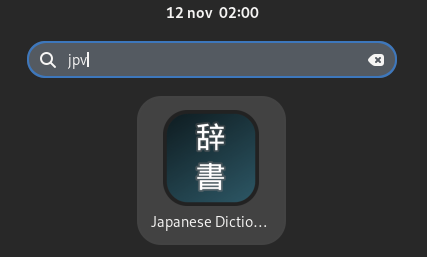
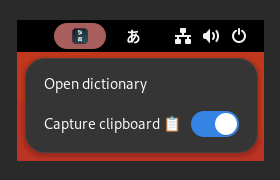

# jpv

Welcome to my personal dictionary project!

<br>

## Building and Installing

Install dependencies for the platform you intend to build for:
* For the `gnome` feature:
  * `Fedora` - `sudo dnf install dbus-devel pkgconf-pkg-config`

Install [`trunk`] and the `wasm32` toolchain to build the UI:

[`trunk`]: https://trunkrs.dev/

```sh
cargo install trunk
cargo toolchain add wasm32-unknown-unknown
```

After this, you can run the project directly in the project directory:

```sh
trunk build --release
cargo run --features bundle
```

There are scripts available to conveniently build and install packages for
various environments:

* [tools/install-fedora] to build and install for GNOME on Fedora.

You can also the project manually, but this will lack any system integration
like clipboard capture:

```
cargo install --path crates/jpv
```

<br>

## Configuring

After `jpv` has been installed, you must construct the dictionary file the
project will use.

```
jpv build
```

After this, you can start the session with:

```
jpv
```


<br>

## Features

* Search for Japanese words and phrases or English glossary.
* Has an intuitive and very comprehensive machine conjugator.
* Comes with a GNOME integration and extension to capture the clipboard for use
  with tools such as [mpvacious].

|  |  |  |
|------------------------------------------------|--------------------------------------------------------------------|-----------------------------------------|
| Searching for english text                     | Conjugations can be searched for and cycled                        | Wildcard searching                      |

[mpvacious]: https://github.com/Ajatt-Tools/mpvacious

<br>

## Building and packing for Fedora GNOME

To build an rpm package which is suitable for Fedora GNOME, you can do the following:

```sh
cargo build --release -p jpv --features bundle,gnome
cargo generate-rpm -p crates/jpv
```

The generated rpm will be located in `target/generate-rpm`.

```sh
sudo npm -i target/generate-rpm/jpv-0.0.0-1.x86_64.rpm
```

Once complete, this installs a desktop entry you can use to start the dictionary
in the background. Starting the application will open up the browser UI.

Note that you still need to build the database before it can be used.



<br>

#### GNOME Extension

Since GNOME and Wayland desktop environments in general currently do not have
any facilities to generically capture the clipboard we must rely on extensions.

To enable the Japanese Dictionary extension for gnome, start the extensions
manager after installing the package:


Once enabled, clipboard capture has to be enabled in the panel item.




> **Note:** while clipboard capture is running the extension icon will be red.
> Only enable it while it's in use since there are currently no security
> mechanisms in place other than your local system. Any application could
> pretend to be a dictionary application and capture the clipboard.

Clipboard capture is governed by the `capture-clipboard-enabled` setting:

```sh
> gsettings get se.tedro.japanese-dictionary.plugins capture-clipboard-enabled
true
> gsettings set se.tedro.japanese-dictionary.plugins capture-clipboard-enabled false
```
